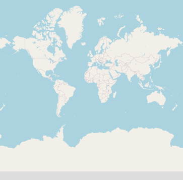
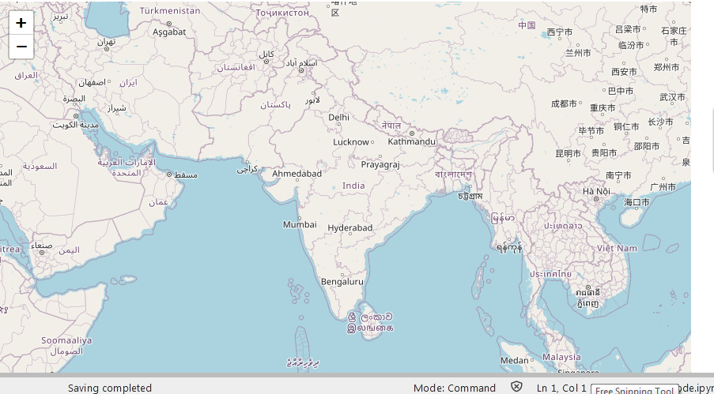
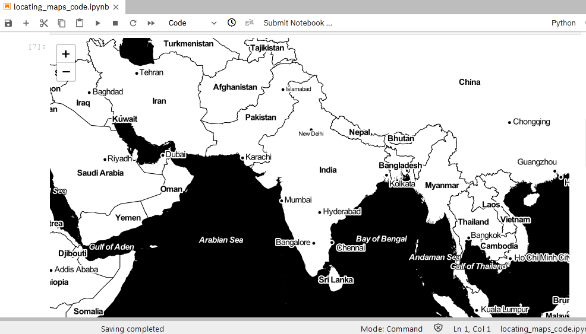
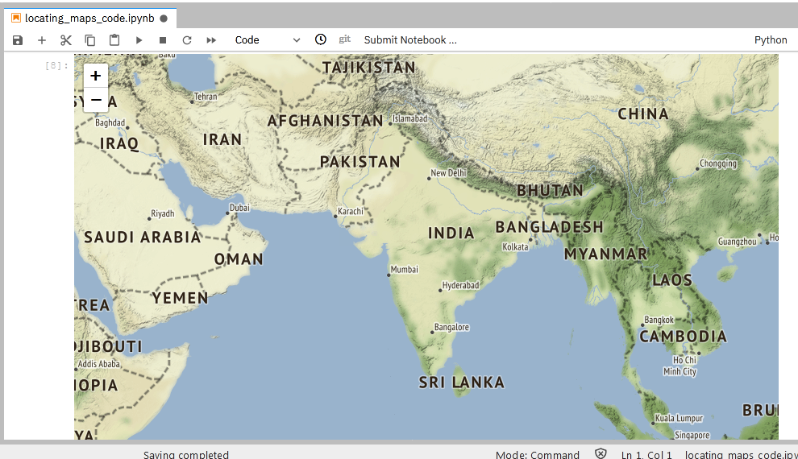
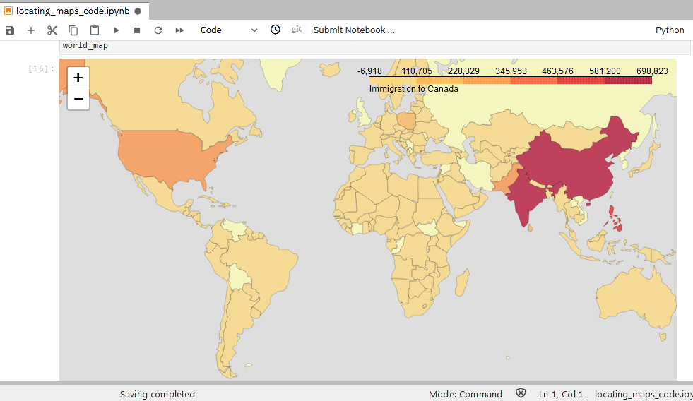

# Locating_maps_using_ipython and Jupyter Notebook By **Mayank Pathak👨‍💻**

Various map plotting has been done using basic python coding in the jupyter notebook.
Follow to try ,implement and practice to match best results possible out of this notebook.

### Run all the commands and coding snippets in the python jupyter notebook and get the suprisingly outputs.


# let's Go step by step to implement and Execute the Coding part

> Note : Run and Execute each code block in **new cell** of Jupyter notebook.


#### Importing Pandas and Numpy
```
import numpy as np  
import pandas as pd
```
We will be doing such ploting and generating maps using Folium. Folium is not available by default. So, we first need to install it before we are able to import it.


#### Let's install Folium
```
!conda install -c conda-forge folium=0.5.0 --yes #installing folium through conda library
import folium

print('Folium installed and imported!')
```
The following packages will be downloaded:

    package                    |            build
    ---------------------------|-----------------
    altair-4.1.0               |             py_1         614 KB  conda-forge
    branca-0.4.1               |             py_0          26 KB  conda-forge
    brotlipy-0.7.0             |py36h8c4c3a4_1000         346 KB  conda-forge
    chardet-3.0.4              |py36h9f0ad1d_1006         188 KB  conda-forge
    cryptography-3.0           |   py36h45558ae_0         640 KB  conda-forge
    folium-0.5.0               |             py_0          45 KB  conda-forge
    pandas-1.0.5               |   py36h830a2c2_0        10.1 MB  conda-forge
    pysocks-1.7.1              |   py36h9f0ad1d_1          27 KB  conda-forge
    toolz-0.10.0               |             py_0          46 KB  conda-forge
    urllib3-1.25.10            |             py_0          92 KB  conda-forge
    vincent-0.4.4              |             py_1          28 KB  conda-forge
    ------------------------------------------------------------
                                           Total:        12.1 MB

#### Display simple map
```
# define the world map
world_map = folium.Map()

# display world map
world_map
```
## Resulted output/Image for simple Map


Go ahead. Try zooming in and out of the rendered map above.

All locations on a map are defined by their respective Latitude and Longitude values. So you can create a map and pass in a center of Latitude and Longitude values of [0,0].

Let's create a map centered around India and play with the zoom level to see how it affects the rendered map

#### Let's create a map centered around India and play with the zoom level to see how it affects the rendered map
```
# define the world map centered around India with a low zoom level
world_map = folium.Map(location=[20, 78], zoom_start=4)

# display world map
world_map
```
## Resulted output/Image for World Map centered around India Map


You can change the various latitude and longitute to go through the different locations and countries.

You can also change to zoom level for initial visualization and then zoom-in and out accordingly.

#### Let's create a Stamen Toner map of India with a zoom level of 4.
```
# create a Stamen Toner map of the world centered around India
world_map = folium.Map(location=[20, 77], zoom_start=4, tiles='Stamen Toner')

# display map
world_map
```

## Resulted output/Image for Stamen Toner map of India


These are high-contrast B+W (black and white) maps. They are perfect for data mashups and exploring river meanders and coastal zones.


#### Let's create a Stamen Terrain map of India with zoom level 4.
```
# create a Stamen Toner map of the world centered around India
world_map = folium.Map(location=[20, 77], zoom_start=4, tiles='Stamen Terrain')

# display map
world_map
```
## Resulted output/Image for Stamen Terrain map of India



#### Now let us import a data from online source using the url and display the Choropleth map

These are maps that feature hill shading and natural vegetation colors. They showcase advanced labeling and linework generalization of dual-carriageway roads.

Feel free to zoom and find the legal roadways and rivers

Now let us import a data from online source using the url and displat the Choropleth map

This data is the immigrants to canada fromdifferent parts of countries

### what is a Choropleth Map :
A Choropleth map is a thematic map in which areas are shaded or patterned in proportion to the measurement of the statistical variable being displayed on the map, such as population density or per-capita income. The choropleth map provides an easy way to visualize how a measurement varies across a geographic area or it shows the level of variability within a region.

```
df_can = pd.read_excel('https://s3-api.us-geo.objectstorage.softlayer.net/cf-courses-data/CognitiveClass/DV0101EN/labs/Data_Files/Canada.xlsx',
                     sheet_name='Canada by Citizenship',
                     skiprows=range(20),
                     skipfooter=2)

print('Data downloaded and read into a dataframe!')
```

#### Show the dataframe as downloaded
```
df_can.head()
```

#### finding Dimension of the dataframe 
```
# print the dimensions of the dataframe
print(df_can.shape)
```

##### Clean up data. We will make some modifications to the original dataset to make it easier to create our visualizations. Refer to Introduction to Matplotlib and Line Plots and Area Plots, Histograms, and Bar Plots notebooks for a detailed description of this preprocessing.
```
# clean up the dataset to remove unnecessary columns (eg. REG) 
df_can.drop(['AREA','REG','DEV','Type','Coverage'], axis=1, inplace=True)

# let's rename the columns so that they make sense
df_can.rename(columns={'OdName':'Country', 'AreaName':'Continent','RegName':'Region'}, inplace=True)

# for sake of consistency, let's also make all column labels of type string
df_can.columns = list(map(str, df_can.columns))

# add total column
df_can['Total'] = df_can.sum(axis=1)

# years that we will be using in this lesson - useful for plotting later on
years = list(map(str, range(1980, 2014)))
print ('data dimensions:', df_can.shape)
```

#### Let's take a look at the first five items of our cleaned dataframe.
```
df_can.head()
```

#### In order to create a Choropleth map, we need a GeoJSON file, let's download it
In order to create a Choropleth map, we need a GeoJSON file that defines the areas/boundaries of the state, county, or country that we are interested in. In our case, since we are endeavoring to create a world map, we want a GeoJSON that defines the boundaries of all world countries. For your convenience, we will be providing you with this file, so let's go ahead and download it. Let's name it world_countries.json.
```
# download countries geojson file
!wget --quiet https://s3-api.us-geo.objectstorage.softlayer.net/cf-courses-data/CognitiveClass/DV0101EN/labs/Data_Files/world_countries.json -O world_countries.json
    
print('GeoJSON file downloaded!')
```

##### Now that we have the GeoJSON file, let's create a world map, centered around [0, 0] latitude and longitude values, with an intial zoom level of 2, and using Mapbox Bright style.
```
world_geo = r'world_countries.json' # geojson file

# create a plain world map
world_map = folium.Map(location=[0, 0], zoom_start=2, tiles='Mapbox Bright')
```
```
# generate choropleth map using the total immigration of each country to Canada from 1980 to 2013
world_map.choropleth(
    geo_data=world_geo,
    data=df_can,
    columns=['Country', 'Total'],
    key_on='feature.properties.name',
    fill_color='YlOrRd', 
    fill_opacity=0.7, 
    line_opacity=0.2,
    legend_name='Immigration to Canada'
)

# display map
world_map
```
## Resulted output/Image for Choropleth map of the World



### Thank you for viewing this notebook

### Just give a try to run cells of code in Jupyter Notebook. You will love ❤ to play with this amazing stuff.

#### You can find the same set of codes executed on Jupyter Notebook By Visiting **👉** [Locating_maps_using_ipython](https://github.com/mayankpathak4513/Locating_maps_using_ipython/blob/master/locating_maps_code.ipynb)

#### This notebook is created by **[Mayank Pathak](https://www.linkedin.com/in/mayank-pathak4513/).** I hope you found this lab interesting and educational. Feel free to contact me if you have any questions!

### If you liked the repository and find it useful then please **Drop a star ⭐**


